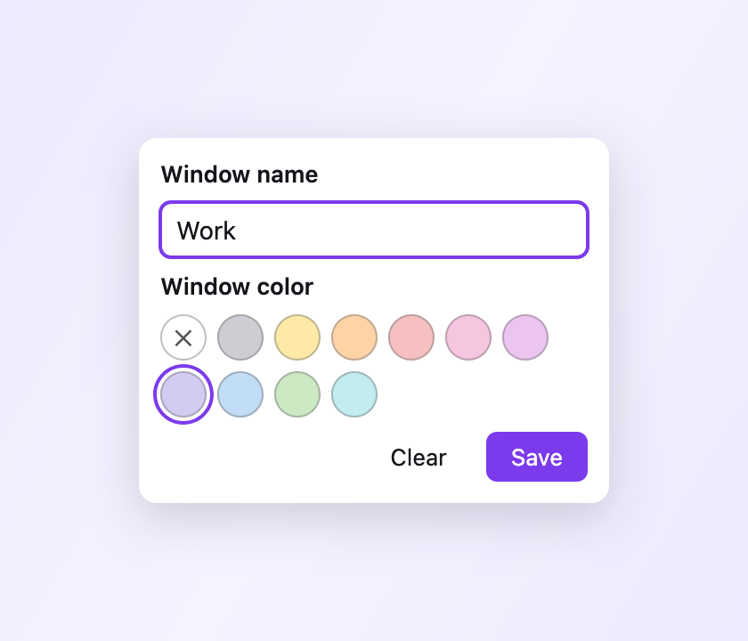
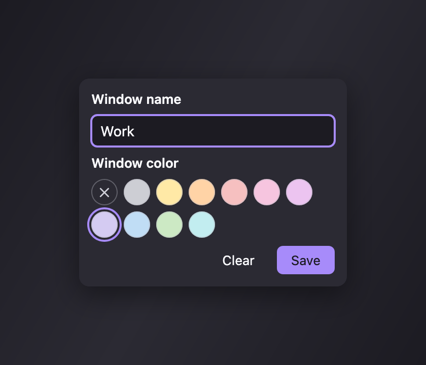

# Window Names

A small Firefox extension that lets you give each browser window a custom name
and color. The name shows up in the title bar, the taskbar/window switcher, and
the macOS dock icon's window list — making it easy to tell windows apart when
you have several open for different contexts (Work, Research, Email…).

The popup, where you name the current window and pick a color (light and dark
themes):

## Features

- **Name a window** — set a custom name per window. It's prepended to the window
  title via `windows.update({ titlePreface })`, so it appears in:
  - the OS title bar,
  - the taskbar / window switcher,
  - the macOS dock icon's right-click window menu.
- **Color a window** — pick from a soft palette (the Firefox profile colors).
  The chrome is themed per window with a tasteful **edge-gradient** look: a
  narrow gradient strip is pinned to each side while a solid color fills the
  stretchy middle, so it resizes gracefully (the same technique the Alpenglow
  theme uses).
- **In-chrome confirmation** — the toolbar button shows the window's name as a
  badge, tinted with the chosen color.

## Install (temporary, for development)

1. Open `about:debugging#/runtime/this-firefox` in Firefox.
2. Click **Load Temporary Add-on…**.
3. Select `manifest.json` from this folder.

Temporary add-ons are removed when Firefox restarts. To enable the title bar on
macOS (where it's hidden by default), see the extension's **Preferences** page
(`about:addons` → Window Names → Preferences).

## How it works & Firefox gotchas

This extension pushed on a few edges of the WebExtension theme/window APIs.
Notes for anyone extending it:

- **Window ids aren't stable across restarts.** Names/colors live for as long as
  a window is open; they don't survive a full browser restart.
- **The native macOS title bar isn't themeable.** Extensions can only set its
  light/dark *scheme* (via `properties.color_scheme`), not an arbitrary color.
- **Per-window themes replace the whole theme** for that window. To restore the
  user's installed theme on clear, we re-enable it through the `management` API,
  because `theme.reset(windowId)` reverts to the *default* theme, not theirs.
  That restore is global, so other colored windows are re-painted afterward.
- **Theme background images can't scale.** We pin a fixed-width gradient PNG to
  each edge and let a solid color fill the middle, and tile it `repeat-y` so the
  strip covers tall regions like a vertical-tab sidebar.
- **An opaque `toolbar` color paints over background images** — set it
  transparent so the gradient shows through.
- **SVG data-URI theme images render unreliably** — generate a raster PNG with
  `OffscreenCanvas` instead.

## Permissions

- `storage` — remember each window's name/color for the session.
- `theme` — color a window's chrome.
- `management` — re-enable your installed theme when a color is cleared.

## License

[MPL-2.0](LICENSE)
